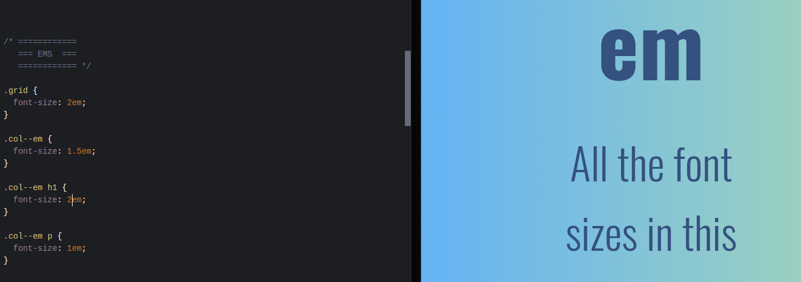
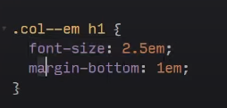
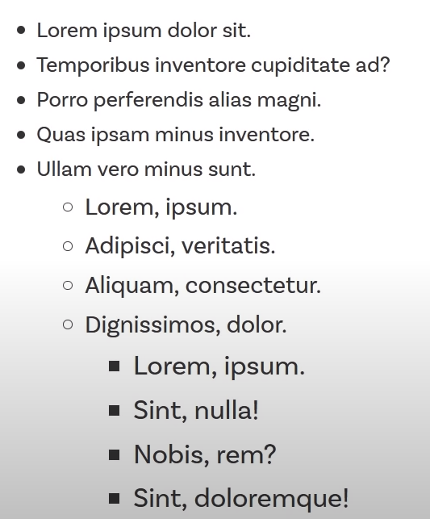
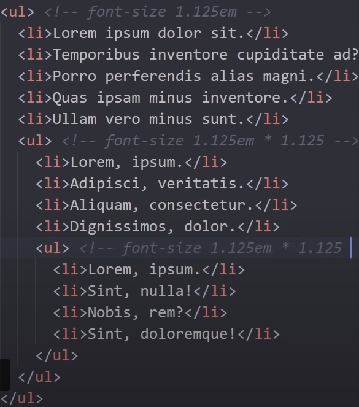

# Responsive-layouts

Learning repsonsive layouts with kevin powell

## Use Percentages:

- Giving width in percentages keeps the layout responsive.
- Percentage given to a child is actually that percent of the parent, i.e., if width of a hild is 80% then it's 80% of the parent.

 

### NOTE : Web is responsive by default, it's our css that makes it non responsive.

 

## Avoid Heights:

- Heights can cause child elemnts to overflow vertically in smaller screens, so avoid giving heights to the parent.

 

## EM vs REM

### em:

- BY DEFAULT: 1em = 16px.
- Child div's em changes in proprtion to the parent div,i.e., it works in a compounding way for font size.
- Example:

  - Here font-size of grid is 16 x 2 = 32px
  - Which will be proportionaly inherited by the child (col--em), which makes font size of col--em : 32 x 1.5 = 48px
  - Similarly, font-size of col--em-h1: 48 x 2 = 96px.
  - And like that it could go out of control if ont used carefully.
    

- For any other property except for font-size (like margin, padding etc. ) it sees the font size of the current div(it adapts according to it whether it is in em or rem)
  - Here margin will be 2.5 x 1 = 2.5em  
    
- **Good** for using in elements like **buttons. margins, paddings** to keep parameters proportional just by changing the font-size.

### rem:

- rem(root em) is same as em, that is, 1rem = 16px.
- But it solves the problem of compounding in em.
- It only changes according to the font-size of the root/html.

 

## Why not use em on font-size?

Since em's have a compounding nature, font-size of child increases/decreases in proportion to that of the parent's. So any change in font size of parent directly reflects changes in font-size of the child element which might be undesirable(in most of the cases).
 
For example:

- Here, child list's are getting enlarged on increasing the font size of the parent list.
  
  

 

## So Where should we use **"em"**?

- For Margins
- For Paddings
- For Buttons(to keep the dimension of the buttons consistent)
- In paragraphs(where we want font-sizes to adjust accordingly w.r.t. the parent)

 

## Using **max-width**:

- **max-width** sets a maximum width to a container after which the container doesn't expands.

 

## CSS Units: **vh, vw, vmin, vmax**

### <u>**vh**</u>:

- **vh** gives size according to the viewport's **height**.

### <u>**vw**</u>:

- **vw** gives size according to the viewport's **width**.

### <u>**vmin**</u>:

- **vmin** gives size according to the viewport's **smaller dimension**, that is, according to height of viewport if height is smaller and width if it's width is smaller.

- Might be a goodd idea to use for the **headings** of the paragraphs.

### <u>**vmax**</u>:

- **vmax** gives size according to the viewport's **larger dimension**, that is, according to height of viewport if height is larger and width if it's width is larger.
